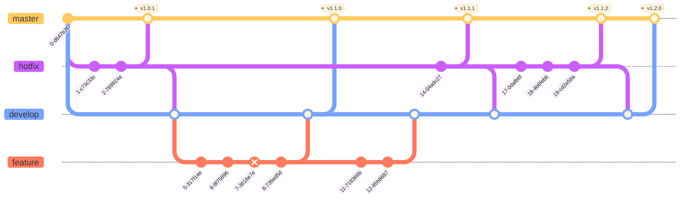

<div align="center">
  
</div>

Ce document décrit les pratiques de développement utilisées sur tous les projets de l'organisation. En suivant ces conventions, tu garantis la cohérence et la qualité de nos bases de code.

- **Collaboration simplifiée** — Avec des règles claires, tout le monde peut contribuer sans se marcher sur les pieds.
- **Onboarding facilité** — Les nouveaux peuvent être productifs dès le premier jour.
- **Cohérence du code** — Un workflow standardisé garantit une base de code propre sur tous nos projets.
- **Historique lisible** — Avec des commits bien structurés, on retrouve facilement qui a fait quoi et pourquoi.
- **Déploiements sereins** — Un processus clair réduit le stress et les erreurs en production.
- **Qualité garantie** — Les revues de code et les tests deviennent un réflexe naturel.

## 🔀 Workflow Git

On utilise un workflow inspiré de **Gitflow**, un modèle de gestion de branches Git qui a fait ses preuves dans de nombreuses organisations. On l'a adapté à nos besoins spécifiques à l'OGEA 12 pour optimiser notre processus de développement et de déploiement.

- Deux branches principales pérennes (`master` et `develop`)
- Des branches de travail temporaires qui naissent et meurent au fil des développements
- Des hotfixes qui peuvent partir de `master` pour les urgences production (et doivent être reportés sur `develop` pour ne pas perdre le fix)

Le diagramme ci-dessous illustre ce workflow en action avec plusieurs cycles de développement :



## 🌳 Architecture des branches

On travaille avec **deux branches principales protégées** :

- **`master`** 🔒

  > Branche de production, contient le code stable déployé

- **`develop`** 🔒

  > Branche de développement, intègre les nouvelles fonctionnalités

### Branches de travail

Toutes tes branches de travail doivent partir de `develop` et suivre une nomenclature précise. Le préfixe permet de comprendre immédiatement le type de travail effectué, ce qui facilite la navigation dans le dépôt et le suivi des pull requests.

- **`feat/*`** — Pour ajouter de nouvelles fonctionnalités
- **`fix/*`** — Pour corriger des bugs
- **`chore/*`** — Pour les tâches de maintenance (mise à jour de dépendances, ...)
- **`docs/*`** — Pour la documentation uniquement
- **`refactor/*`** — Pour améliorer le code sans changer son comportement
- **`test/*`** — Pour ajouter ou modifier des tests

### Bonnes pratiques

Lorsque tu travailles sur une branche, respecte ces règles pour maintenir un workflow fluide, tu dois toujours :

- Créer ta branche depuis `develop`
- Merger `develop` dans `master` pour les releases en production
- Utiliser `--squash` lors du merge dans `develop`
- Supprimer la branche de travail après le merge
- Tester le code avant de merger
- Faire relire son code (code review)

## 📝 Convention de nommage des commits

On utilise la spécification [Conventional Commits](https://www.conventionalcommits.org/fr/) pour structurer nos messages de commit. Cette convention permet de :

- 🤖 Générer automatiquement des changelogs
- 🔍 Comprendre rapidement l'historique du projet
- 🎯 Identifier facilement le type de changement
- 🚀 Automatiser les releases avec le bon numéro de version

### Format du message

Chaque commit doit respecter cette structure. Le `type` et la `description` sont **obligatoires**, le reste est optionnel mais recommandé pour les changements complexes.

```
<type>(<scope>): <description>

[corps optionnel]

[footer optionnel]
```

### Types de commits

Voici tous les types de commits acceptés dans l'organisation. Choisis le bon type en fonction de la nature de ton changement :

- ✨ **`feat`** — Ajoute une nouvelle fonctionnalité visible par l'utilisateur
- 🐛 **`fix`** — Corrige un bug existant
- 📚 **`docs`** — Modifie uniquement la documentation
- 💄 **`style`** — Change le formatage sans modifier la logique (espaces, virgules, etc.)
- ♻️ **`refactor`** — Réécrit du code pour l'améliorer sans changer son comportement
- ✅ **`test`** — Ajoute ou modifie des tests
- 🔧 **`chore`** — Tâches de maintenance (dépendances, config, build, etc.)
- ⚡ **`perf`** — Améliore les performances
- 👷 **`ci`** — Modifie les workflows d'intégration continue

## 📋 Guide pratique

Cette section présente des exemples concrets pour les opérations courantes de notre workflow Git. Chaque exemple détaille la séquence complète de commandes, du début du développement jusqu'au nettoyage final.

### Création d'une feature

Voici le processus complet pour développer une nouvelle fonctionnalité. Tu commences par créer une branche depuis `develop`, tu développes ta feature en faisant des commits réguliers, puis tu merges en squash pour avoir un historique propre sur `develop`. Enfin, tu nettoies en supprimant la branche de travail.

```bash
git checkout develop
git pull origin develop
git checkout -b feat/<nom-de-la-feature>

git add .
git commit -m "feat: description intermédiaire"

git push -u origin feat/<nom-de-la-feature>

git checkout develop
git pull origin develop
git merge --squash feat/<nom-de-la-feature>
git commit -m "feat: description finale"
git push origin develop

git branch -d feat/<nom-de-la-feature>
git push --delete origin feat/<nom-de-la-feature>
```

### Création d'un hotfix

Les hotfixes sont des correctifs urgents qui partent directement de `master`. Une fois le bug corrigé, tu merges d'abord dans `master` avec un tag de version, puis tu reportes obligatoirement le fix dans `develop` pour éviter qu'il ne soit perdu lors de la prochaine release. C'est une étape critique du workflow.

```bash
git checkout master
git pull origin master
git checkout -b fix/<nom-du-hotfix>

git add .
git commit -m "fix: description intermédiaire"

git push -u origin fix/<nom-du-hotfix>

git checkout master
git merge --squash fix/<nom-du-hotfix>
git commit -m "fix: description finale"
git tag -a v1.0.1 -m "v1.0.1"
git push origin master --tags

git checkout develop
git pull origin develop
git merge --squash fix/<nom-du-hotfix>
git commit -m "fix: description finale"
git push origin develop

git branch -d fix/<nom-du-hotfix>
git push --delete origin fix/<nom-du-hotfix>
```
